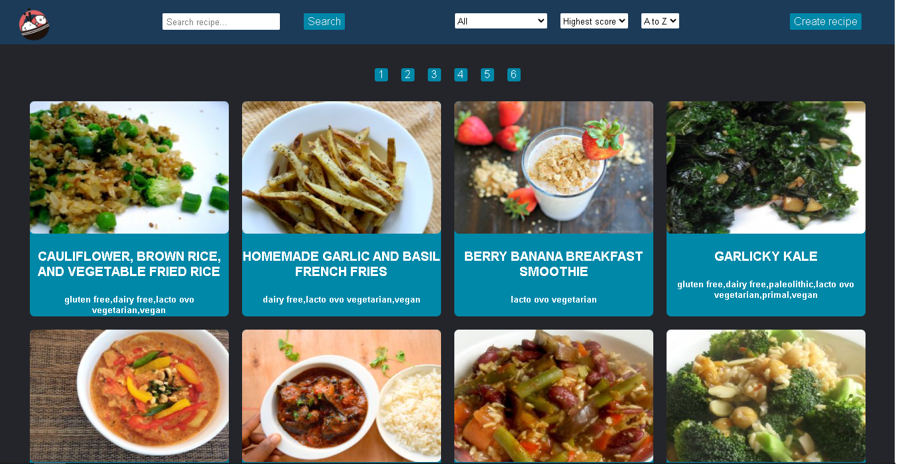
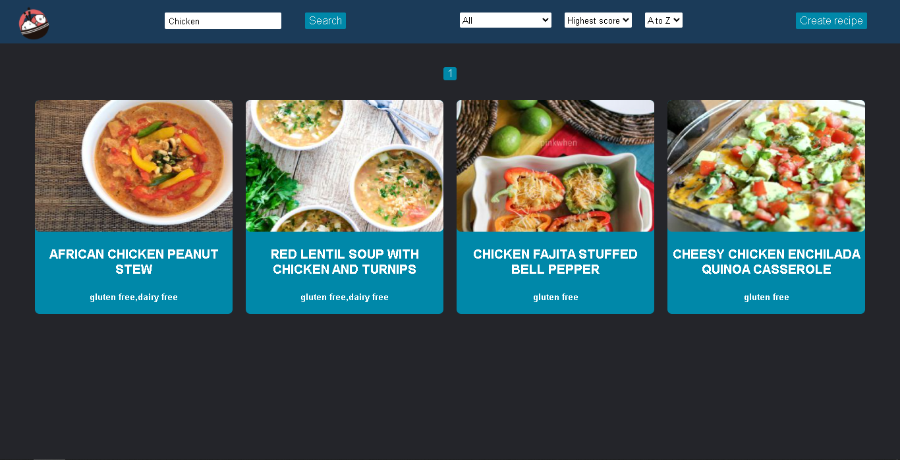
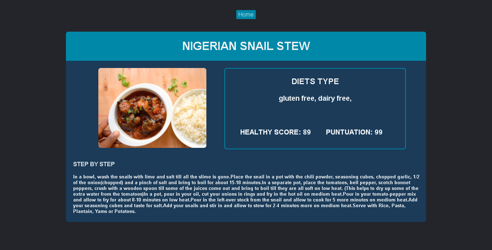
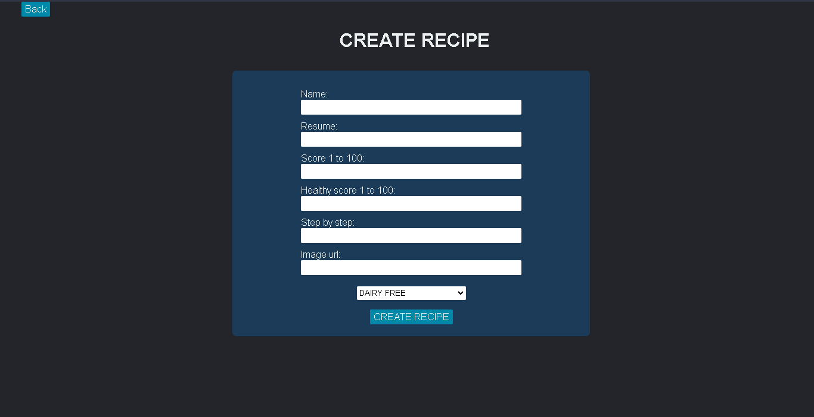

# Individual Project - Recipe App

  

## Qué utilidad tiene la aplicacion?

La apliacion esta diseñada para publicar/encontrar/descrubrir comidas de todos los tipos de dietas, se puede filtrar por puntaje de salubridad, puntuacion general, tipos
de dietas, por orden alfabetico, por orden ascendente/descendente de acuerdo a la puntuacion general. A su vez tambien tienes una barra de búsqueda para encontrar alguna receta en especifico. Se puede encontrar cualquier tipo de comida y si te interesa una receta en especifico tienes la receta tambien disponible. Si tienes una receta en mente que te gusta puedes eres libre de publicarla a traves del formulario de creacion de receta que la guarda en la base de datos local,

## Qué tecnologías se usaron para desarrollar la aplicacion? 

Para el frontend se hizo uso de React, Redux y CSS puro para los estilos sin ninguna librería externa. Para el backend se desarrolló un servidor en Express, la base de datos fue creada con Sequelize y PostgreSQL.

